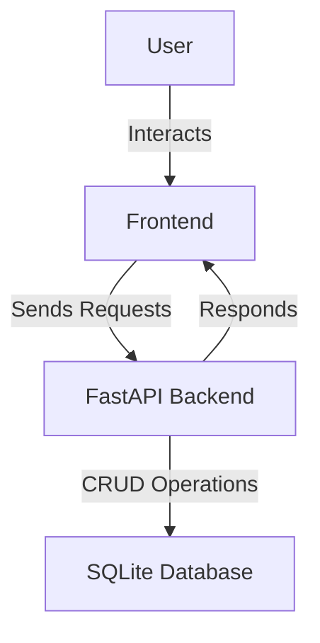

# AI-Powered Personal Finance Manager

## Overview
The AI-Powered Personal Finance Manager is a sophisticated application designed to help users manage their financial activities with ease and efficiency. This application leverages AI-driven insights to offer users a comprehensive view of their financial health, including transaction tracking, budget management, and personalized financial insights. By automating financial management tasks, this tool is ideal for individuals seeking to maintain financial discipline, track spending habits, and optimize their budgets without the hassle of manual calculations.

The application is built using FastAPI, a modern web framework for building APIs with Python 3.11+. It features a robust backend that handles user authentication, data storage, and retrieval, while the frontend provides users with an intuitive interface to interact with their financial data. This project is particularly beneficial for tech-savvy individuals, financial advisors, and anyone interested in leveraging technology to enhance their financial management.

## Features
- **User Registration and Authentication**: Secure user registration and login system using OAuth2 and JWT tokens.
- **Transaction Management**: Add, view, and manage financial transactions with ease.
- **Budget Tracking**: Set and monitor budgets, track spending, and view remaining budget.
- **AI-Driven Insights**: Gain insights into spending habits and financial health through AI analysis.
- **Responsive Dashboard**: Access a user-friendly dashboard to view financial summaries and insights.
- **Cross-Origin Resource Sharing (CORS)**: Enabled CORS to allow secure cross-origin requests and data sharing.
- **Database Management**: Utilizes SQLite for efficient data storage and retrieval.

## Tech Stack
| Technology    | Description                             |
|---------------|-----------------------------------------|
| FastAPI       | Web framework for building APIs         |
| Uvicorn       | ASGI server for running FastAPI apps    |
| SQLAlchemy    | ORM for database management             |
| Passlib       | Password hashing library                |
| Python-Jose   | JWT encoding and decoding               |
| Pydantic      | Data validation and settings management |
| SQLite        | Lightweight database engine             |

## Architecture
The project architecture consists of a FastAPI backend that serves a responsive frontend built with HTML and Bootstrap. The backend manages user authentication, transaction, and budget data, which is stored in an SQLite database. The frontend interacts with the backend through defined API endpoints.



## Getting Started

### Prerequisites
- Python 3.11+
- pip (Python package manager)
- Docker (optional for containerized deployment)

### Installation
1. Clone the repository:
   ```bash
   git clone https://github.com/yourusername/ai-powered-personal-finance-manager-auto.git
   cd ai-powered-personal-finance-manager-auto
   ```
2. Create a virtual environment:
   ```bash
   python3 -m venv venv
   source venv/bin/activate  # On Windows use `venv\Scripts\activate`
   ```
3. Install dependencies:
   ```bash
   pip install -r requirements.txt
   ```

### Running the Application
1. Start the FastAPI application:
   ```bash
   uvicorn app:app --reload
   ```
2. Open your browser and visit `http://localhost:8000` to access the application.

## API Endpoints
| Method | Path                  | Description                          |
|--------|-----------------------|--------------------------------------|
| POST   | /api/register         | Register a new user                  |
| POST   | /api/login            | User login and token retrieval       |
| GET    | /api/transactions     | Retrieve a list of transactions      |
| GET    | /api/budget           | Retrieve the user's budget details   |
| POST   | /api/transactions     | Create a new transaction             |

## Project Structure
```
.
├── app.py                  # Main application file with API logic
├── Dockerfile              # Docker configuration for containerization
├── requirements.txt        # List of Python dependencies
├── start.sh                # Shell script to start the application
├── static/
│   └── css/
│       └── style.css       # CSS styles for the frontend
└── templates/
    ├── dashboard.html      # HTML template for the dashboard
    ├── index.html          # HTML template for the homepage
    ├── login.html          # HTML template for the login page
    ├── register.html       # HTML template for the registration page
    └── settings.html       # HTML template for the settings page
```

## Screenshots
*Screenshots of the application will be added here.*

## Docker Deployment
1. Build the Docker image:
   ```bash
   docker build -t finance-manager .
   ```
2. Run the Docker container:
   ```bash
   docker run -d -p 8000:8000 finance-manager
   ```

## Contributing
Contributions are welcome! Please fork the repository and submit a pull request for any enhancements or bug fixes. Ensure your code follows the project's coding standards and includes appropriate tests.

## License
This project is licensed under the MIT License.

---
Built with Python and FastAPI.